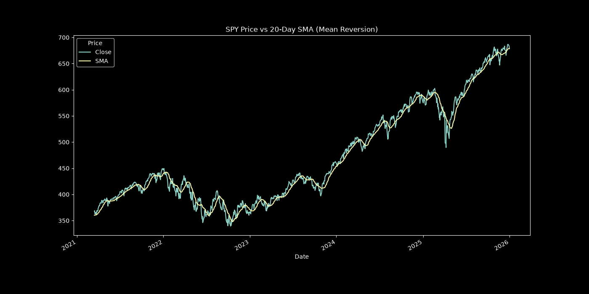
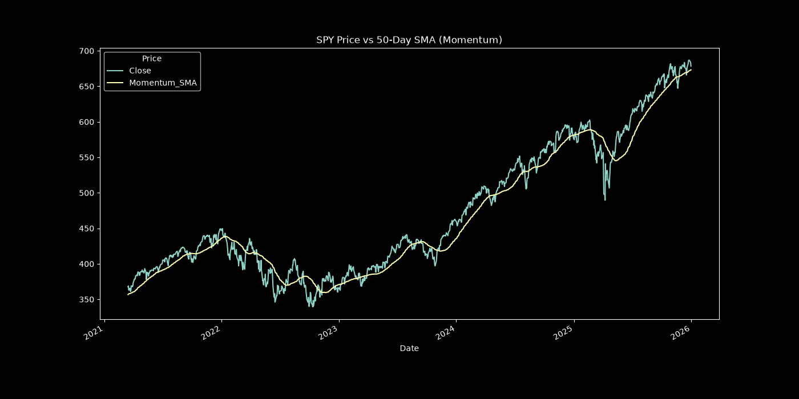

# Vectorized Quantitative Strategy Comparison

A vectorized (NumPy/pandas) backtesting engine that compares three trading approaches on SPY — Mean Reversion, Momentum, and Buy & Hold — across a 5-year period (2021-01-04 to 2025-12-31, 1,255 trading days).

## Overview

This project builds a backtesting framework from scratch to evaluate two systematic trading signals against a passive benchmark, with a focus on doing the backtest *correctly* — no look-ahead bias, fully vectorized (no loops), and standard risk-adjusted performance metrics.

## Strategies

**Mean Reversion (Z-Score)**
Computes a 20-day rolling mean and standard deviation of SPY's closing price, then a Z-score measuring how many standard deviations the current price is from its recent average. Goes long when the price is more than 2 standard deviations below the mean (oversold), short when more than 2 above (overbought), and flat otherwise.

**Momentum (SMA Crossover)**
Uses a 50-day rolling SMA as a trend filter. Goes long when price is above the SMA (uptrend), short when below (downtrend).

**Buy & Hold**
Passive benchmark — stays fully long SPY for the entire period.

All signals are shifted forward by one day before being applied to returns, so that each day's trade only ever uses information that was actually available at that point in time (no look-ahead bias).

## Methodology

- **Data**: Daily SPY closing prices, 2021-01-01 to 2026-01-01, pulled via `yfinance`.
- **Returns**: Daily log returns, so cumulative performance can be computed with a simple cumulative sum instead of compounding manually.
- **Backtest engine**: Each strategy's daily return is calculated as `position × market_return`, fully vectorized with NumPy (no explicit loop over days).
- **Risk-free rate**: Assumed to be 0% for the Sharpe ratio calculation (a simplification — see Limitations).
- **Annualization**: 252 trading days/year is used to scale daily statistics to annual figures.

## Results

| Strategy | Annual Return | Annual Volatility | Sharpe Ratio | Max Drawdown |
|---|---|---|---|---|
| **Buy & Hold** | 12.74% | 17.12% | **0.744** | -24.50% |
| **Mean Reversion** | 2.06% | 6.64% | 0.311 | **-8.39%** |
| **Momentum** | 3.47% | 17.14% | 0.202 | -32.77% |

## Key Findings

- **Buy & Hold had the best risk-adjusted return** (Sharpe ratio 0.74) over this period, driven by a strong, low-volatility bull market in SPY from 2021–2025. Neither active strategy beat the benchmark on a return or Sharpe basis.
- **Mean Reversion was the strongest strategy on risk control**, cutting annualized volatility by 61% and max drawdown by 66% relative to Buy & Hold, at the cost of significantly lower absolute return. This makes it a candidate for a *capital preservation* overlay rather than a return-maximizing strategy on its own.
- **Momentum underperformed on every metric** in this window — a simple 50-day SMA crossover reacts slowly to trend changes and got repeatedly whipsawed during 2022's choppy, range-bound conditions, resulting in the worst Sharpe ratio and deepest drawdown of the three.
- This is a useful, realistic illustration of a common finding in quant backtesting: **simple systematic strategies frequently fail to beat a strong bull-market benchmark**, and the "best" strategy depends heavily on whether the objective is maximizing return or minimizing risk.

## Limitations

This is a simplified backtest intended to demonstrate signal construction and evaluation methodology, not a production-ready trading strategy. Notable simplifications:

- No transaction costs or slippage
- No position sizing or risk management (fixed +1/-1 exposure regardless of signal strength or volatility)
- Single asset (SPY) and a single historical period — no out-of-sample or walk-forward validation
- Risk-free rate assumed to be 0% in the Sharpe ratio calculation
- No statistical significance testing on the Sharpe ratios (i.e., no check for whether the differences are distinguishable from noise)

## Future Improvements
 
Planned extensions to make this closer to a realistic, tradeable framework:
 
- **Volatility targeting** — scale position size inversely to realized volatility (e.g., target 10% annualized vol) rather than using a fixed ±1 exposure, to reduce drawdown without giving up as much upside as Mean Reversion currently does.
- **Transaction costs and slippage** — apply a per-trade cost (e.g., a few bps) to see how much of each strategy's edge survives realistic trading frictions.
- **Regime-switching model** — use a longer-term trend filter (e.g., price vs. 200-day SMA) to dynamically switch between Momentum in trending regimes and Mean Reversion in range-bound regimes, rather than running both independently for the full period.
- **Multi-asset testing** — extend beyond SPY to a small universe of sector ETFs or asset classes, combined into an equal-weight or volatility-weighted portfolio, to test whether diversification improves risk-adjusted returns.
- **Out-of-sample / walk-forward validation** — split the data into in-sample and out-of-sample periods to check whether results generalize, rather than evaluating strategies on the same window they were designed against.
- **Statistical significance testing** — bootstrap or permutation testing on the Sharpe ratios to check whether the differences between strategies are distinguishable from noise.
- **Non-zero risk-free rate** — incorporate an actual risk-free rate (e.g., 3-month T-bill yield) into the Sharpe ratio calculation instead of assuming 0%.

## Tech Stack

- Python
- pandas / NumPy — data handling and vectorized backtest logic
- yfinance — historical price data
- matplotlib — visualization
